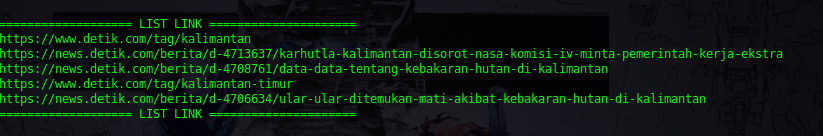
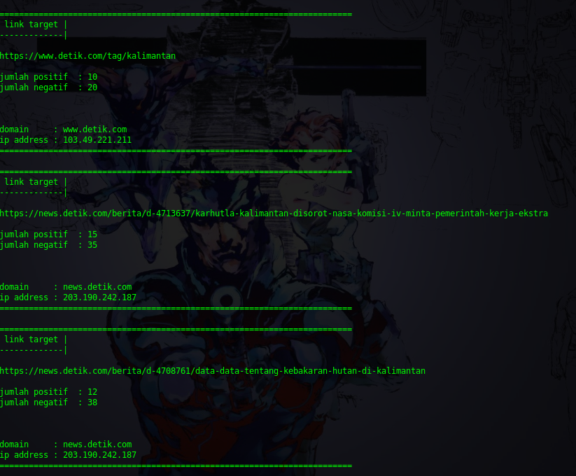

# NewsAnalyzer
Menilai berita dari banyaknya kata positif dan negatif sebuah berita

## Bahan
bahan yang diperlukan untuk membangun ***analyzer*** ini adalah:
- python3
- python nltk
- python google-search
- python search
- python google
- python clear_screen
- python html5lib

untuk memenuhi bahannya jalanin command ini:
```
pip3 install nltk
pip3 install google-search
pip3 install search
pip3 install google
pip3 install clear_screen
pip3 install html5lib
```
## Cara Kerja
ketika aplikasi dijalankan, halaman pertama yang akan muncul adalah sebagai berikut:


pada contoh gambar diatas, saya mencoba mencari informasi dengan tiga parameter:
1. situs berita : **detik.com/berita/**
2. keyword berita : **kalimantan**
3. jumlah link yang akan dianalisis : **5**

setelah memasukkan parameter yang dibutuhkan, berikut adalah link teratas pada detik.com/berita/ terkait keyword kalimantan




aplikasi akan menganalisa setiap kata pada seitap link halaman berita, berikut ini adalah cuplikan tiga link teratas dari lima link:





output full nya adalah sebagai berikut:

```
========================================================================
 link target |
-------------|

https://www.detik.com/tag/kalimantan

jumlah positif  : 10
jumlah negatif  : 20


domain     : www.detik.com
ip address : 103.49.221.211
========================================================================

========================================================================
 link target |
-------------|

https://news.detik.com/berita/d-4713637/karhutla-kalimantan-disorot-nasa-komisi-iv-minta-pemerintah-kerja-ekstra

jumlah positif  : 15
jumlah negatif  : 35


domain     : news.detik.com
ip address : 203.190.242.187
========================================================================

========================================================================
 link target |
-------------|

https://news.detik.com/berita/d-4708761/data-data-tentang-kebakaran-hutan-di-kalimantan

jumlah positif  : 12
jumlah negatif  : 38


domain     : news.detik.com
ip address : 203.190.242.187
========================================================================

========================================================================
 link target |
-------------|

https://www.detik.com/tag/kalimantan-timur

jumlah positif  : 3
jumlah negatif  : 19


domain     : www.detik.com
ip address : 103.49.221.211
========================================================================

========================================================================
 link target |
-------------|

https://news.detik.com/berita/d-4706634/ular-ular-ditemukan-mati-akibat-kebakaran-hutan-di-kalimantan

jumlah positif  : 12
jumlah negatif  : 43


domain     : news.detik.com
ip address : 203.190.242.187
========================================================================
```

setelah pemrosesan selesai, semua link yang telah didapatkan secara otomatis akan terbuka di browser:


